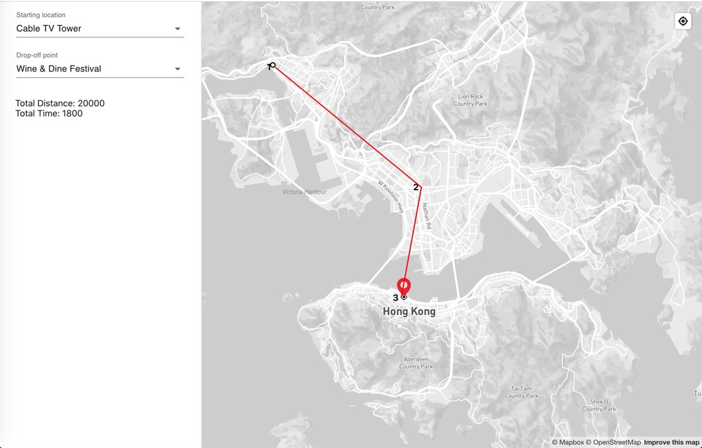
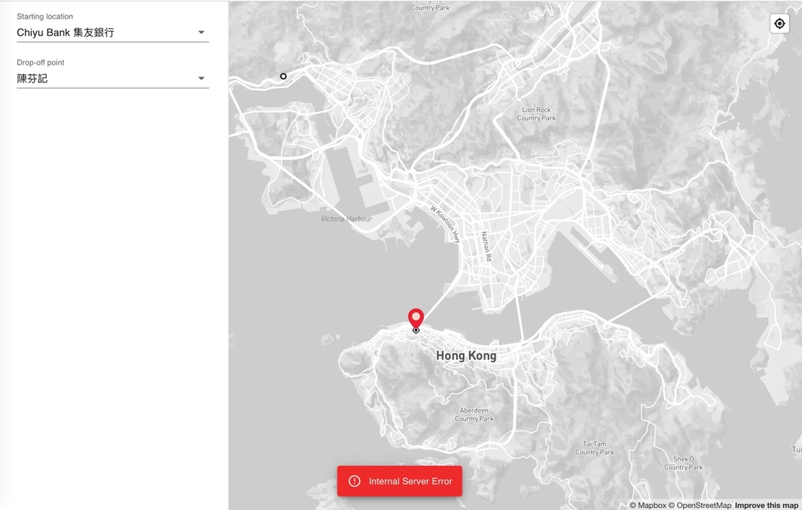
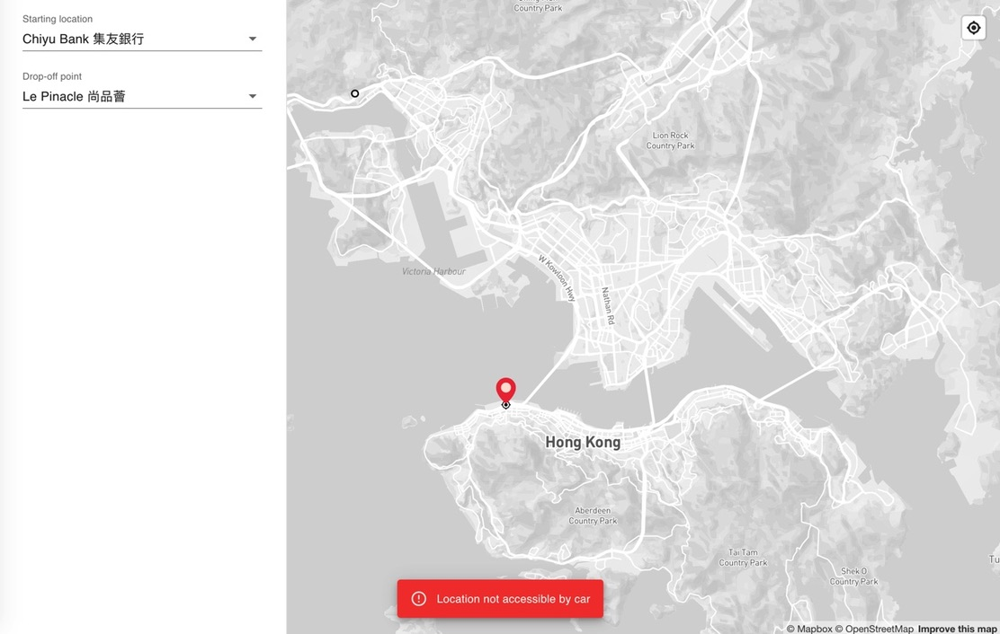
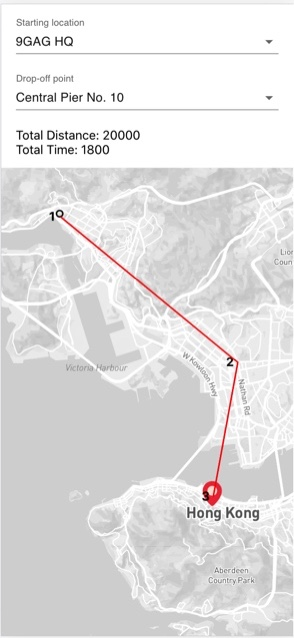
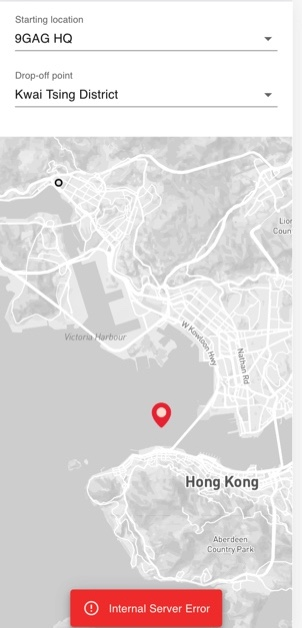
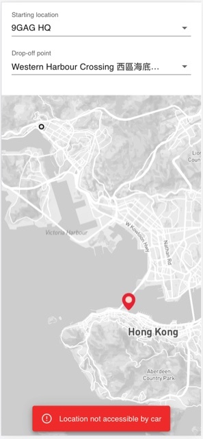

# map-route-demo
A map router which provides functions like location pickup and routing.

## Usage
**STEP 1:** Perform `yarn install` or `npm install`

**STEP 2:** Follow this link to apply for a new access token: 
https://docs.mapbox.com/help/tutorials/get-started-tokens-api/. then fill it into `.env`

**STEP 3:** Perform `yarn start` or `npm start`

**STEP 4:** Open [https://localhost:3000](https://localhost:3000) to view it in the browser. (Please accept the risk and continue)

## Test
Perform `yarn test`

## Build
Perform `yarn build` or `npm run build`, `./build` would be generated for production deployment.

### Demo
**Succeed:**

**Internal Server Error:**

**Location not accessible by car:**

**Succeed - Mobile:**

**Internal Server Error - Mobile:**

**Location not accessible by car - Mobile:**

## Author
Messi Li

licaomeng@gmail.com